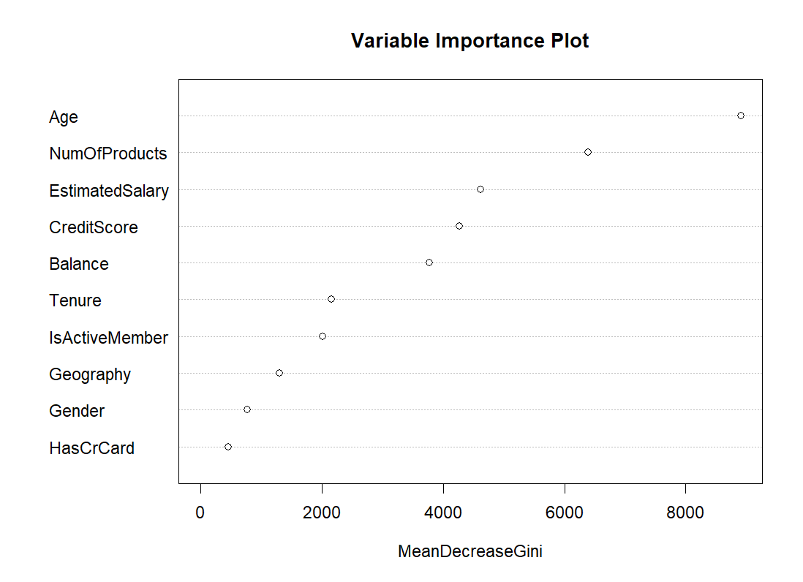

# Bank Customer Churn Prediction - Random Forest Model

## Project Overview
This project aims to analyze factors influencing customer churn in a banking dataset. By identifying key characteristics of high-risk customers, banks can take proactive measures to retain them. We built a **Random Forest model** to predict customer churn based on various demographic and financial attributes.

## 📂Project Structure
```bash
├── 📂 result # summary of model
     ├── 📄 bank1.png # ROC curve
     ├── 📄 bank2.png # importance of variables
├── 📄 README.md # This documentation 
├── 📄 randomforest.r # Random Forest model training and evaluation 
├── 📄 requirements.txt # List of dependencies 
```

## Dataset Information
- **Source**: Kaggle - [Binary Classification with a Bank Churn Dataset](https://www.kaggle.com/competitions/playground-series-s4e1/overview)
- **Size**: 165,034 customer records
- **Features**:
  - **Demographic Data**: Age, Gender, Geography
  - **Financial Information**: Credit Score, Balance, Estimated Salary, Number of Products
  - **Customer Behavior**: Active Membership, Credit Card Ownership
  - **Target Variable (`Exited`)**: Indicates whether a customer has left the bank (1 = Churn, 0 = Retained)

## Data Preprocessing
Before training the model, we applied the following preprocessing steps:
1. **Feature Selection**: Removed ID-related columns (`id`, `CustomerId`, `Surname`) as they are non-informative.
2. **Category Balancing**: Re-grouped `NumOfProducts` into two categories to address class imbalance.
3. **Feature Scaling**: Standardized numerical features using `StandardScaler`.
4. **Encoding**: Converted categorical variables into numerical format using `OneHotEncoder`.
5. **Train-Test Split**: Randomly divided data into **80% training** and **20% testing**.

## Random Forest Model
### **Model Configuration**
- **Number of Trees (`n_estimators`)**: 500
- **Criterion**: Gini impurity
- **Maximum Depth (`max_depth`)**: 45
- **Minimum Samples per Leaf**: 1
- **Minimum Samples per Split**: 1

### **Feature Importance (Mean Decrease Gini)**
We used **Mean Decrease Gini** to measure the importance of features. The top influential factors were:
1. **Age** - Older customers are more likely to churn.
2. **Active Membership** - Active members have lower churn rates.
3. **Number of Products** - Customers using fewer products are more likely to churn.
4. **Gender** - Males tend to have a slightly lower churn rate.
5. **Geography** - Customers from different regions exhibit different churn behaviors.

### **Performance Metrics**
| Model           | Accuracy | AUC Score |
|----------------|----------|-----------|
| Logistic Regression | 83.5% | 0.8327 |
| **Random Forest** | **86.6%** | **0.8779** |

- The **Random Forest model** achieved a higher **AUC score (0.8779)** compared to Logistic Regression (0.8327), indicating superior predictive performance.
- However, **Random Forest requires more computational resources**. Banks can decide whether to prioritize accuracy or efficiency based on deployment needs.
- 
<p align="center">
    
    
</p>


## Environment Setup
Ensure R is installed and install dependencies using:
```r
install.packages(c("readxl", "MASS", "randomForest", "pROC", "Metrics"))
```

## Future Improvements
- **Test Gradient Boosting models (e.g., XGBoost, LightGBM) for potential performance gains**.
- **Explore deep learning approaches such as neural networks**.
- **Incorporate additional customer data (e.g., transaction history) to enhance predictive power**.

## References
1.Kaggle. Binary Classification with a Bank Churn Dataset (2024).  
2.Leo Breiman (2001). Random Forests. Machine Learning, 45(1), 5–32.  
3.Cohen, J. et al. (2003). Applied Multiple Regression/Correlation Analysis for the Behavioral Sciences. Lawrence Erlbaum.

